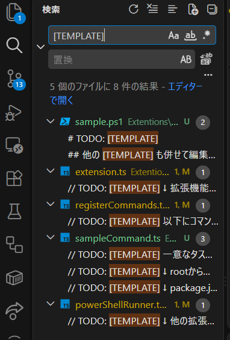

## 最初にすること

### 1. パッケージインストール

rootディレクトリで以下を実行します
```sh
pnpm install
```

### 2. デバッガの起動チェック

その後、`src/extension.ts`を開き、`F5`キーを押します。
これで、デバッグウィンドウが開くのを確認してください。

## サンプルコードを見る

以下のように「`[TEMPLATE]`」を検索してください。



`[TEMPLATE]`のそばに開発の仕方が書いてあります。
